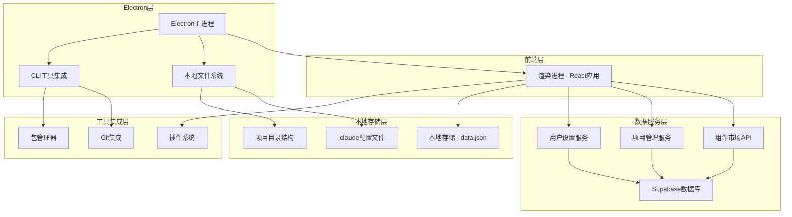
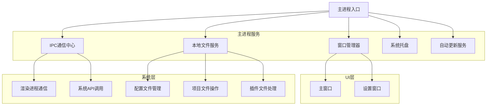
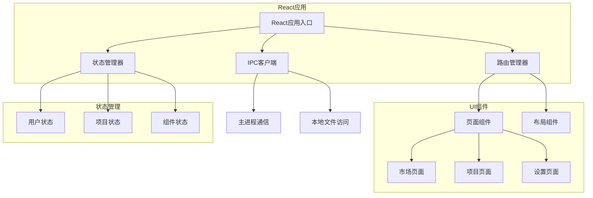

## 1. 架构设计



## 2. 技术描述

### 2.1 核心技术栈

- **桌面应用框架**: Electron@27 + TypeScript
- **前端框架**: React@18 + TypeScript + Vite
- **状态管理**: React Context + useReducer + Zustand
- **UI组件库**: Ant Design@5 + Tailwind CSS@3
- **数据库**: Supabase (PostgreSQL + Realtime)
- **文件系统**: Node.js fs + electron-store
- **HTTP客户端**: Axios + React Query
- **插件系统**: 自定义插件架构 + Sandboxed execution
- **初始化工具**: electron-vite

### 2.2 开发工具链

- **构建工具**: electron-vite + vite
- **代码质量**: ESLint + Prettier + TypeScript
- **测试框架**: Jest + React Testing Library + Playwright
- **打包发布**: electron-builder
- **依赖管理**: npm + electron-rebuild

## 3. 路由定义

### 3.1 应用路由结构

| 路由 | 用途 | 组件 |
|------|------|------|
| / | 应用主页，展示市场概览 | HomePage |
| /market | 组件市场，支持搜索筛选 | MarketPage |
| /market/:category | 按分类浏览组件 | CategoryPage |
| /component/:name | 组件详情页面 | ComponentDetailPage |
| /projects | 项目管理页面 | ProjectsPage |
| /projects/new | 创建新项目 | NewProjectPage |
| /projects/:id | 项目详情和管理 | ProjectDetailPage |
| /settings | 设置主页面 | SettingsPage |
| /settings/general | 基础设置 | GeneralSettingsPage |
| /settings/sources | 组件源管理 | SourcesSettingsPage |
| /settings/advanced | 高级设置 | AdvancedSettingsPage |
| /about | 关于页面 | AboutPage |

### 3.2 路由守卫

- **权限验证**: 基于用户角色的路由访问控制
- **数据预加载**: 路由级别的数据获取和缓存
- **错误边界**: 路由级别的错误处理和恢复

## 4. Electron架构设计

### 4.1 主进程架构



### 4.2 渲染进程架构



### 4.3 IPC通信边界

#### 4.3.1 主进程暴露的API

```typescript
// 窗口控制API
interface WindowAPI {
  minimize(): void
  maximize(): void
  close(): void
  setSize(width: number, height: number): void
}

// 文件系统API
interface FileSystemAPI {
  readFile(path: string): Promise<string>
  writeFile(path: string, content: string): Promise<void>
  exists(path: string): Promise<boolean>
  createDirectory(path: string): Promise<void>
  selectDirectory(): Promise<string>
  selectFile(): Promise<string>
}

// 项目API
interface ProjectAPI {
  createProject(config: ProjectConfig): Promise<Project>
  getProjects(): Promise<Project[]>
  updateProject(id: string, updates: Partial<Project>): Promise<Project>
  deleteProject(id: string): Promise<void>
  installComponent(projectId: string, component: Component): Promise<void>
}

// 设置API
interface SettingsAPI {
  getSettings(): Promise<AppSettings>
  updateSettings(settings: Partial<AppSettings>): Promise<void>
  resetSettings(): Promise<void>
}
```

#### 4.3.2 渲染进程调用规范

```typescript
// IPC通道定义
const IPC_CHANNELS = {
  // 窗口控制
  WINDOW_MINIM