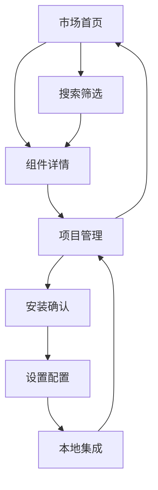

## 1. 产品概述

Claude代码模板市场是一个集成化的开发工具平台，为开发者提供Claude代码组件的发现、安装和管理功能。该平台整合了agents、commands、hooks、MCP服务器等多种类型的开发资源，支持项目级管理和本地文件系统集成，旨在提升开发效率和代码复用率。

产品核心价值：通过集中化的组件市场，降低开发门槛，加速项目初始化过程，提供标准化的开发工作流模板。

## 2. 核心功能

### 2.1 用户角色

| 角色    | 注册方式         | 核心权限                 |
| ----- | ------------ | -------------------- |
| 普通开发者 | 无需注册         | 浏览市场、搜索组件、查看详情、安装到项目 |
| 高级用户  | GitHub OAuth | 发布组件、管理个人组件、查看下载统计   |
| 企业用户  | 企业认证         | 私有组件库、团队协作、批量部署      |

### 2.2 功能模块

Claude代码模板市场包含以下核心功能模块：

1. **Market/Projects/Settings三合一工作台**：集成化界面设计，支持快速切换和上下文关联
2. **智能组件搜索引擎**：支持多维度筛选、语义搜索和个性化推荐
3. **项目级组件管理**：可视化项目配置、依赖管理和版本控制
4. **本地开发环境集成**：无缝连接本地文件系统和CLI工具
5. **插件生态系统**：支持自定义插件源和私有仓库

### 2.3 页面详情

| 页面名称 | 模块名称   | 功能描述                                    |
| ---- | ------ | --------------------------------------- |
| 市场首页 | 智能推荐引擎 | 基于用户行为和项目历史的个性化组件推荐                     |
| 市场首页 | 热门排行榜  | 实时更新的下载量、评分、趋势统计展示                      |
| 市场首页 | 分类导航   | 支持agents、commands、hooks、mcp、skills等类型筛选 |
| 组件详情 | 信息展示   | 详细的组件描述、版本历史、依赖关系、使用示例                  |
| 组件详情 | 安装向导   | 项目选择、配置预览、安装进度跟踪                        |
| 项目管理 | 项目工作台  | 项目创建、配置管理、组件依赖可视化                       |
| 项目管理 | 本地集成   | 文件系统浏览、CLI命令生成、配置文件自动更新                 |
| 系统设置 | 全局配置   | 默认路径、网络代理、组件源管理                         |
| 系统设置 | 高级选项   | 性能优化、安全设置、备份恢复                          |

## 3. 核心流程

### 3.1 组件发现与安装流程

用户进入市场页面 → 智能推荐展示 → 搜索/筛选组件 → 查看详情和评分 → 选择目标项目 → 配置安装参数 → 执行安装 → 本地文件更新 → 项目配置生效

### 3.2 项目管理流程

创建新项目 → 选择项目类型和路径 → 配置基础设置 → 浏览和选择组件 → 可视化依赖管理 → 生成配置文件 → 本地项目初始化 → 组件安装验证

### 3.3 设置与配置流程

进入设置页面 → 配置基础偏好 → 设置组件源 → 配置网络代理 → 设置安全选项 → 保存并应用 → 同步到本地配置

### 页面导航流程图



## 4. 用户界面设计

### 4.1 设计规范

* **主色调**：深色主题 (#1a1a1a) 配橙色高亮 (#ea580c)，护眼且专业

* **辅助色彩**：成功绿 (#10b981)、警告黄 (#f59e0b)、错误红 (#ef4444)

* **字体系统**：Inter字体族，14px基础字号，良好的可读性层级

* **布局风格**：三栏响应式布局，左侧导航、中间内容、右侧详情

* **交互元素**：圆角设计、平滑过渡、悬停效果、加载动画

### 4.2 页面设计概述

| 页面名称 | 模块名称 | UI元素               |
| ---- | ---- | ------------------ |
| 市场首页 | 顶部导航 | Logo、搜索框、用户菜单、设置入口 |
| 市场首页 | 侧边栏  | 分类筛选、标签云、排序选项      |
| 市场首页 | 主内容区 | 卡片网格布局、分页控制、统计信息   |
| 组件详情 | 头部信息 | 标题、作者、评分、下载量、版本    |
| 组件详情 | 内容区域 | 描述、示例、依赖、文档、评论区    |
| 项目管理 | 项目列表 | 卡片式项目展示、快速操作按钮     |
| 项目管理 | 配置面板 | 表单输入、文件选择、预览区域     |
| 系统设置 | 设置分组 | 标签页组织、表单控件、保存按钮    |

### 4.3 响应式设计

* **桌面端**：完整功能展示，三栏布局，最小宽度1200px

* **平板端**：优化触摸体验，双栏布局，最小宽度768px

* **移动端**：核心功能优先，单栏布局，手势操作支持

* **跨平台**：Electron封装，支持Windows、macOS、Linux

### 4.4 3D场景指导

虽然本产品主要是2D界面，但在数据可视化和组件展示方面可以引入轻微的3D效果：

* **环境**：简洁的工作室环境，使用柔和的环境光

* **光照**：主光源+补光，营造层次感但不过于花哨

* **动画**：卡片翻转、数据图表3D旋转、过渡动画

* **性能**：保持60fps流畅度，合理使用GPU加速

## 5. 数据结构设计

### 5.1 data.json核心结构

```json
{
  "marketPath": "/default/market/path",
  "projects": [
    {
      "id": "uuid",
      "name": "project-name",
      "path": "/full/project/path",
      "type": "javascript|python|typescript|other",
      "description": "项目描述",
      "createdAt": "2024-01-01T00:00:00Z",
      "updatedAt": "2024-01-01T00:00:00Z",
      "components": [
        {
          "name": "component-name",
          "type": "agent|command|hook|mcp|skill",
          "version": "1.0.0",
          "installedAt": "2024-01-01T00:00:00Z",
          "source": "marketplace|local|custom"
        }
      ],
      "settings": {
        "autoUpdate": true,
        "backupEnabled": true,
        "proxyConfig": {
          "enabled": false,
          "host": "",
          "port": 8080
        }
      }
    }
  ],
  "userPreferences": {
    "theme": "dark|light|auto",
    "language": "zh-CN|en-US",
    "defaultInstallPath": "/default/path",
    "sources": [
      {
        "name": "官方源",
        "url": "https://aitmpl.com",
        "enabled": true,
        "priority": 1
      }
    ],
    "notifications": {
      "updateAvailable": true,
      "installComplete": true,
      "errorAlerts": true
    }
  },
  "statistics": {
    "totalInstalls": 0,
    "mostUsedComponents": [],
    "recentActivity": []
  }
}
```

### 5.2 插件能力定义

插件系统支持以下核心能力：

* **Agents**：AI智能体定义，包含角色描述、技能列表、工作流

* **Commands**：CLI命令模板，支持参数化和条件执行

* **Hooks**：生命周期钩子，在特定时机触发自定义逻辑

* **MCP Servers**：模型上下文协议服务器，扩展AI能力

* **Skills**：技能包，封装特定领域的能力集合

### 5.3 合并策略

多源组件合并遵循以下策略：

* **优先级规则**：本地 > 自定义源 > 官方源

* **版本冲突**：最新版本优先，用户可选择特定版本

* **依赖解析**：自动检测和解决依赖冲突

* **配置合并**：智能合并相似配置，保留用户自定义设置

## 6. 扩展性设计

### 6.1 插件架构

* **模块化设计**：核心功能与插件完全解耦

* **动态加载**：运行时加载和卸载插件

* **沙箱隔离**：插件运行在独立环境中，确保安全性

* **API标准化**：统一的插件接口和数据格式

### 6.2 主题系统

* **CSS变量**：使用CSS自定义属性实现主题切换

* **组件主题**：每个UI组件支持独立主题配置

* **动态主题**：支持用户自定义颜色和样式

* **主题市场**：提供丰富的预制主题供选择

### 6.3 国际化支持

* **多语言**：支持中英文切换，可扩展更多语言

* **本地化**：日期、数字、货币等本地格式

* **RTL支持**：为从右到左的语言提供支持

* **文化适配**：图标、

