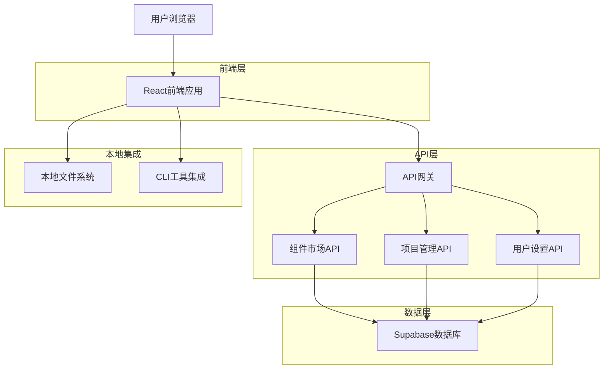
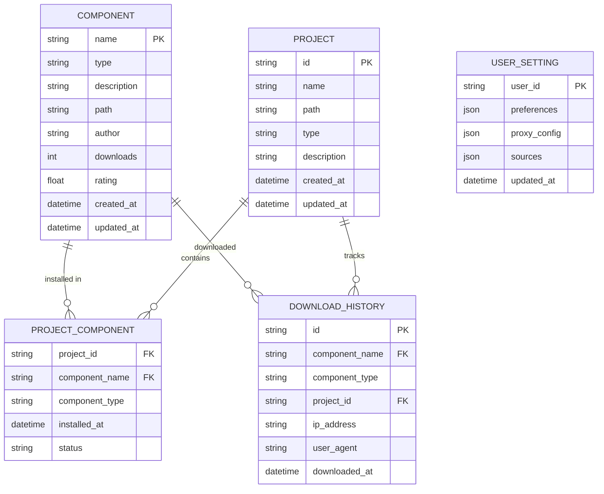

## 1. 架构设计



## 2. 技术描述
- 前端：React + TypeScript + Vite
- 状态管理：React Context + useReducer
- 路由：React Router v6
- UI组件库：Ant Design
- HTTP客户端：Axios
- 本地文件操作：Browser File API
- 初始化工具：vite-init

## 3. 路由定义
| 路由 | 用途 |
|------|------|
| / | 市场首页，展示热门和最新组件 |
| /market | 组件市场，支持搜索和筛选 |
| /market/:type | 按类型浏览组件 |
| /component/:name | 组件详情页面 |
| /projects | 项目管理页面 |
| /projects/new | 创建新项目 |
| /projects/:id | 项目详情和管理 |
| /settings | 用户设置页面 |
| /settings/general | 基础设置 |
| /settings/sources | 组件源管理 |
| /settings/advanced | 高级设置 |

## 4. API定义

### 4.1 组件市场API

**获取组件列表**
```
GET /api/components
```

请求参数：
| 参数名 | 类型 | 必需 | 描述 |
|--------|------|------|------|
| type | string | false | 组件类型筛选 |
| category | string | false | 分类筛选 |
| search | string | false | 搜索关键词 |
| sort | string | false | 排序方式（downloads, rating, created） |
| page | number | false | 页码，默认1 |
| limit | number | false | 每页数量，默认20 |

响应：
```json
{
  "data": [
    {
      "name": "agent-name",
      "type": "agent",
      "description": "组件描述",
      "downloads": 1234,
      "rating": 4.5,
      "author": "author-name",
      "path": "agents/category/agent-name.md",
      "created_at": "2024-01-01T00:00:00Z"
    }
  ],
  "total": 100,
  "page": 1,
  "limit": 20
}
```

**获取组件详情**
```
GET /api/components/:name
```

**记录组件下载**
```
POST /api/components/:name/download
```

请求体：
```json
{
  "project_id": "项目ID",
  "cli_version": "1.0.0"
}
```

### 4.2 项目管理API

**获取项目列表**
```
GET /api/projects
```

**创建项目**
```
POST /api/projects
```

请求体：
```json
{
  "name": "项目名称",
  "path": "/path/to/project",
  "type": "javascript",
  "description": "项目描述"
}
```

**安装组件到项目**
```
POST /api/projects/:id/components
```

请求体：
```json
{
  "component_name": "组件名称",
  "component_type": "agent"
}
```

### 4.3 用户设置API

**获取用户设置**
```
GET /api/settings
```

**更新用户设置**
```
PUT /api/settings
```

请求体：
```json
{
  "default_path": "/default/install/path",
  "auto_update": true,
  "proxy_config": {
    "enabled": false,
    "host": "",
    "port": 8080
  },
  "sources": [
    {
      "name": "官方源",
      "url": "https://aitmpl.com",
      "enabled": true
    }
  ]
}
```

## 5. 数据模型

### 5.1 数据模型定义


### 5.2 数据库表结构

**组件表 (components)**
```sql
CREATE TABLE components (
    name VARCHAR(255) PRIMARY KEY,
    type VARCHAR(50) NOT NULL,
    description TEXT,
    path VARCHAR(500) NOT NULL,
    author VARCHAR(100),
    downloads INTEGER DEFAULT 0,
    rating DECIMAL(2,1) DEFAULT 0.0,
    created_at TIMESTAMP DEFAULT CURRENT_TIMESTAMP,
    updated_at TIMESTAMP DEFAULT CURRENT_TIMESTAMP
);

CREATE INDEX idx_components_type ON components(type);
CREATE INDEX idx_components_author ON components(author);
CREATE INDEX idx_components_downloads ON components(downloads DESC);
```

**项目表 (projects)**
```sql
CREATE TABLE projects (
    id UUID PRIMARY KEY DEFAULT gen_random_uuid(),
    name VARCHAR(255) NOT NULL,
    path VARCHAR(500) UNIQUE NOT NULL,
    type VARCHAR(50) NOT NULL,
    description TEXT,
    created_at TIMESTAMP DEFAULT CURRENT_TIMESTAMP,
    updated_at TIMESTAMP DEFAULT CURRENT_TIMESTAMP
);

CREATE INDEX idx_projects_type ON projects(type);
CREATE INDEX idx_projects_created_at ON projects(created_at DESC);
```

**项目组件关联表 (project_components)**
```sql
CREATE TABLE project_components (
    project_id UUID REFERENCES projects(id) ON DELETE CASCADE,
    component_name VARCHAR(255) REFERENCES components(name) ON DELETE CASCADE,
    component_type VARCHAR(50) NOT NULL,
    installed_at TIMESTAMP DEFAULT CURRENT_TIMESTAMP,
    status VARCHAR(20) DEFAULT 'active',
    PRIMARY KEY (project_id, component_name)
);

CREATE INDEX idx_project_components_project ON project_components(project_id);
CREATE INDEX idx_project_components_component ON project_components(component_name);
```

**下载历史表 (download_history)**
```sql
CREATE TABLE download_history (
    id UUID PRIMARY KEY DEFAULT gen_random_uuid(),
    component_name VARCHAR(255) REFERENCES components(name),
    component_type VARCHAR(50) NOT NULL,
    project_id UUID REFERENCES projects(id),
    ip_address INET,
    user_agent TEXT,
    downloaded_at TIMESTAMP DEFAULT CURRENT_TIMESTAMP
);

CREATE INDEX idx_download_history_component ON download_history(component_name);
CREATE INDEX idx_download_history_project ON download_history(project_id);
CREATE INDEX idx_download_history_date ON download_history(downloaded_at DESC);
```

## 6. 状态管理设计

### 6.1 全局状态结构
```typescript
interface AppState {
  // 组件市场状态
  market: {
    components: Component[];
    categories: string[];
    searchQuery: string;
    selectedType: string;
    loading: boolean;
    error: string | null;
  };
  
  // 项目状态
  projects: {
    list: Project[];
    currentProject: Project | null;
    loading: boolean;
    error: string | null;
  };
  
  // 用户设置状态
  settings: {
    defaultPath: string;
    autoUpdate: boolean;
    proxyConfig: ProxyConfig;
    sources: Source[];
    loading: boolean;
    error: string | null;
  };
  
  // UI状态
  ui: {
    theme: 'light' | 'dark';
    sidebarCollapsed: boolean;
    notifications: Notification[];
  };
}
```

### 6.2 关键操作
- `LOAD_COMPONENTS`: 加载组件列表
- `INSTALL_COMPONENT`: 安装组件
- `CREATE_PROJECT`: 创建新项目
- `UPDATE_SETTINGS`: 更新用户设置
- `SET_CURRENT_PROJECT`: 切换当前项目

## 7. 文件夹结构
```
src/
├── components/          # 通用组件
│   ├── ComponentCard/   # 组件卡片
│   ├── SearchBar/       # 搜索栏
│   ├── InstallButton/   # 安装按钮
│   └── ProjectSelector/ # 项目选择器
├── pages/              # 页面组件
│   ├── Market/        # 市场页面
│   ├── Projects/      # 项目页面
│   └── Settings/      # 设置页面
├── hooks/             # 自定义Hooks
│   ├── useComponents.ts
│   ├── useProjects.ts
│   └── useSettings.ts
├── services/          # API服务
│   ├── api.ts        # API基础配置
│   ├── components.ts # 组件相关API
│   ├── projects.ts   # 项目相关API
│   └── settings.ts   # 设置相关API
├── store/            # 状态管理
│   ├── context.tsx   # Context配置
│   ├── reducer.ts    # Reducer函数
│   └── actions.ts    # Action定义
├── types/            # TypeScript类型定义
├── utils/            # 工具函数
└── App.tsx          # 主应用组件
```