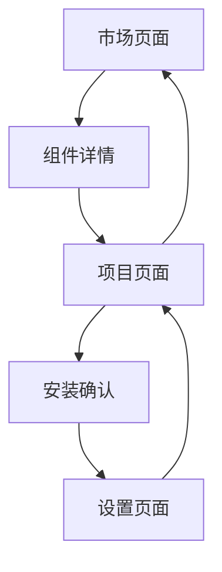

## 1. 产品概述

Claude前端项目是一个用于管理和展示Claude代码模板的市场平台。用户可以通过该界面浏览、搜索、安装和管理各种Claude代码组件，包括agents、commands、hooks、MCP服务器等。该平台旨在为开发者提供一个集中化的Claude代码组件发现和获取渠道。

## 2. 核心功能

### 2.1 用户角色

| 角色   | 注册方式         | 核心权限                  |
| ---- | ------------ | --------------------- |
| 普通用户 | 无需注册         | 浏览市场、搜索组件、查看组件详情、安装组件 |
| 开发者  | GitHub OAuth | 发布组件、管理自己的组件、查看统计数据   |

### 2.2 功能模块

Claude前端项目包含以下主要页面：

1. **市场页面**：组件浏览、搜索筛选、分类展示、热门推荐
2. **项目页面**：项目管理、组件安装、配置文件生成、本地项目设置
3. **设置页面**：用户偏好、安装路径配置、组件源管理、高级选项

### 2.3 页面详情

| 页面名称 | 模块名称  | 功能描述                                    |
| ---- | ----- | --------------------------------------- |
| 市场页面 | 搜索栏   | 支持关键词搜索、组件类型筛选、分类过滤                     |
| 市场页面 | 组件列表  | 展示组件卡片、显示下载量、评分、作者信息                    |
| 市场页面 | 分类导航  | 按类型分类（agents、commands、hooks、mcp、skills） |
| 市场页面 | 热门推荐  | 基于下载量推荐热门组件                             |
| 项目页面 | 项目配置  | 选择项目路径、生成.claude配置文件                    |
| 项目页面 | 组件安装  | 选择并安装组件到本地项目                            |
| 项目页面 | 安装历史  | 查看已安装的组件和历史记录                           |
| 设置页面 | 基础设置  | 配置默认安装路径、界面语言                           |
| 设置页面 | 组件源管理 | 添加/删除自定义组件源                             |
| 设置页面 | 高级选项  | CLI工具路径、网络代理配置                          |

## 3. 核心流程

### 3.1 组件发现与安装流程

用户在市场页面浏览或搜索组件 → 查看组件详情 → 点击安装 → 选择目标项目 → 生成配置文件 → 下载组件到本地

### 3.2 项目管理流程

用户创建或选择项目 → 配置项目路径 → 选择需要的组件 → 生成.claude目录结构 → 安装依赖 → 完成项目初始化

### 页面导航流程图

## 4. 用户界面设计

### 4.1 设计规范

* **主色调**：深灰色背景 (#1a1a1a) 搭配橙色 accent (#ea580c)

* **按钮样式**：圆角矩形，hover状态有颜色变化

* **字体**：系统默认字体，主要文字14-16px

* **布局风格**：卡片式布局，左侧导航，右侧内容区域

* **图标风格**：使用简洁的线条图标

### 4.2 页面设计概述

| 页面名称 | 模块名称  | UI元素                   |
| ---- | ----- | ---------------------- |
| 市场页面 | 搜索栏   | 顶部搜索框，类型筛选下拉菜单，分类标签    |
| 市场页面 | 组件卡片  | 卡片布局，包含图标、名称、描述、下载量、评分 |
| 项目页面 | 项目选择器 | 文件夹选择按钮，路径显示，项目类型选择    |
| 项目页面 | 组件列表  | 已安装组件列表，安装按钮，版本信息显示    |
| 设置页面 | 设置表单  | 输入框、开关按钮、下拉选择器、保存按钮    |

### 4.3 响应式设计

* 桌面端优先设计，最小宽度1200px

* 平板端适配，最小宽度768px

* 移动端提供简化版本，核心功能可用

### 4.4 交互细节

* 搜索实时响应，输入延迟300ms后执行搜索

* 组件卡片hover效果，显示更多操作按钮

* 安装过程显示进度条和状态提示

* 错误信息使用toast通知，3秒后自动消失

